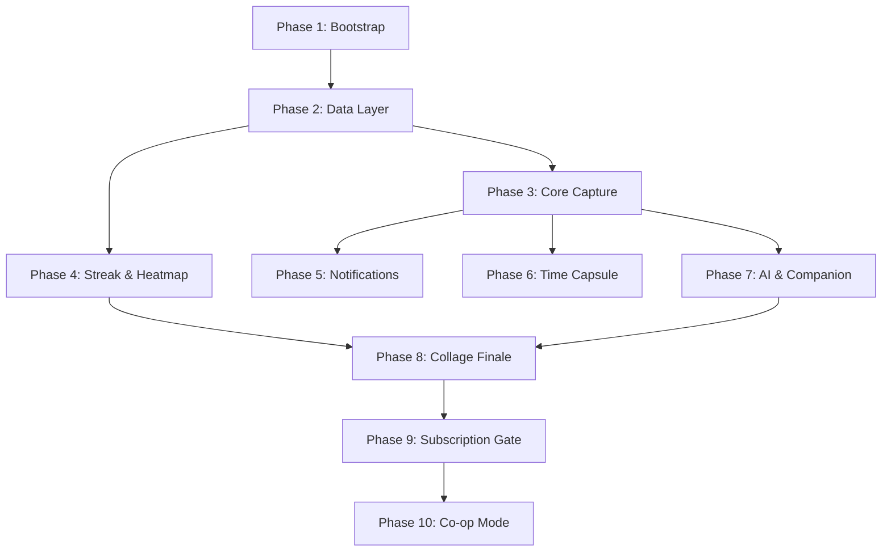

# memory_friend — Step-by-Step Development Roadmap

## Architecture Overview

---

## Phase 1 — Project Bootstrap

**Goal:** Runnable Expo dev build with navigation shell and theme.

- Init Expo project with dev build config (`app.config.js`, `app.json`, `babel.config.js`)
- Install core deps: `react-navigation`, `zustand`, `react-native-mmkv`, `@nozbe/watermelondb`, `react-native-vision-camera`, `ffmpeg-kit-react-native`, `notifee`, `react-i18next`, `openai`
- Set up `src/` directory structure matching the target map in `index.mdc`
- Configure React Navigation: root `NavigationContainer`, bottom tabs (Home, Capture, Journal, Profile), plus a modal stack
- Apply dark mode theme: deep space black bg, Poppins + Inter/SF Pro fonts, blue/orange accent tokens
- Wire i18n with `en.json` base locale

---

## Phase 2 — Data Layer

**Goal:** Offline-first storage foundation everything else builds on.

- WatermelonDB schema + initial migration with tables: `goals`, `journal_entries`, `streak_state`, `badges`, `capsules`, `ai_enrichments`
- Model classes under `src/models/`
- Database bootstrap in `src/database/`
- MMKV key registry in `src/utils/mmkv.ts` (streak cache, countdown timer, session flags)
- Base Zustand stores in `src/stores/` (goal store, UI store)

---

## Phase 3 — Core Capture Flow (15-Second Flow)

**Goal:** User can record video/audio/mood in under 15 seconds.

- Vision Camera capture screen (`src/features/journal/CaptureScreen`)
- Mood/emoji picker after capture ("How was today?" prompt)
- Haptic feedback on completion (`src/utils/haptics.ts`)
- Save journal entry to WatermelonDB with file path reference (never blob)
- Journal list/history view with empathetic empty states
- Frictionless 3-step onboarding: Goal name → Target date → Start

---

## Phase 4 — Streak & Heatmap

**Goal:** Duolingo-style chain + GitHub-style emotion calendar.

- Streak engine in `src/features/streak/` — daily check-in detection, chain counting
- Badges model + award logic (first entry, 7-day streak, 30-day streak, etc.)
- Celebration animation on milestone (confetti/lottie)
- GitHub-style emotion heatmap component on Home screen (color-coded by mood tag)
- MMKV cache for fast streak display on cold launch

---

## Phase 5 — Empathetic Notification System

**Goal:** Contextual, motivational reminders — never guilt-tripping.

- Notifee channel setup in `src/features/notification/`
- Daily reminder scheduling with contextual copy (distance-to-goal aware)
- Final-stretch messages: "We're in the final week — how are you doing today?"
- Behavioral psychology rules: no accusatory copy, invite-don't-shame tone
- Notification permission prompt wired into onboarding

---

## Phase 6 — Time Capsule

**Goal:** Record a message to your future self, delivered on a hard day.

- Capsule creation screen: record video/audio + set unlock date
- Capsule stored in WatermelonDB with `unlocks_at` date
- Lock/unlock state in UI (sealed vs viewable)
- Delivery trigger: notification on unlock date + special reveal screen

---

## Phase 7 — AI Companion (Whisper + GPT)

**Goal:** Speech-to-text journal + emotion tagging + contextual encouragement.

- OpenAI client wrapper in `src/features/ai/` with offline fallback
- Whisper speech-to-text hook wired to audio capture
- GPT emotion tagging: returns emotion tags (stressed, motivated, exhausted, etc.) stored in `ai_enrichments`
- Contextual push: "3 days of 'exhausted' — you bounced back from this before!"
- Hype Man: milestone detected → mini celebratory animation using past happy photos
- All AI calls non-blocking; capture completes offline if API unavailable

---

## Phase 8 — Collage Finale ("Cinema Hall")

**Goal:** On target day, generate a cinematic short film from the journey.

- FFmpegKit pipeline in `src/features/collage/`: trim clips → merge → apply music
- Emotion-adaptive music selection (calm for stable journey, building for growth arc)
- Premiere screen: full-screen "Cinema Hall" reveal UI, separate from standard app chrome
- Free tier: standard slideshow export
- Pro tier: cinematic edit + licensed music + 4K + social aspect ratios

---

## Phase 9 — Subscription Gate (Freemium → Pro)

**Goal:** Gate Pro features without degrading Free experience.

- `FeatureLimits` constants + `canUse*` helpers in `src/features/subscription/`
- Paywall entry screen with Pro feature showcase
- Gate points: 4K export, cinematic edit, licensed music, unlimited cloud backup, custom aspect ratios, AI companion messages
- RevenueCat or equivalent for in-app purchase management

---

## Phase 10 — Co-op Mode

**Goal:** Shared journeys for couples, friends, study buddies.

- Duo goal creation and invite flow
- Shared timeline: hidden voice notes / encouragement videos that unlock on specific days
- Split-screen finale: synchronized video of both journeys side by side
- Backend sync layer (the only feature requiring server infrastructure)
